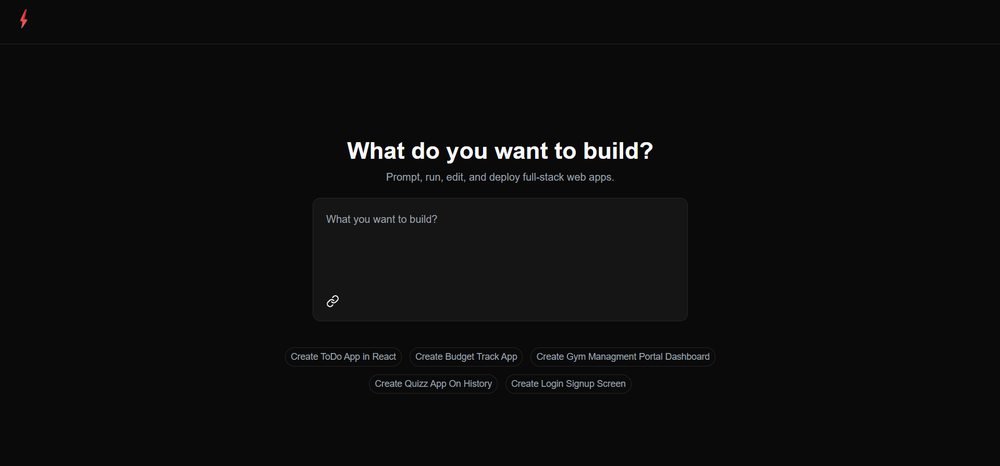
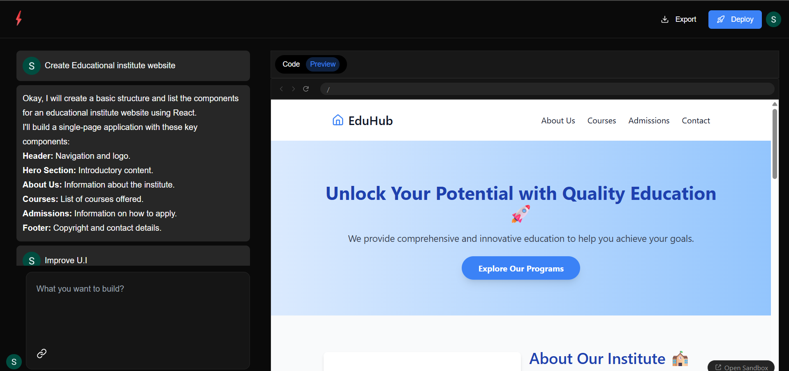

# 🚀 CodeRobo

**CodeRobo** is an AI-powered code generation and collaboration platform. It allows developers to instantly generate full-stack projects, collaborate in real-time, preview code live, and export or deploy their work with a single click.

## 🌟 Features

- 🔐 **User Authentication**: OAuth-based login using Google, powered by `react-oauth` and `uuid4`.
- 🧠 **AI Code Generation**: Integrated with Google AI Studio for intelligent code generation and debugging support.
- 💬 **AI Chatbot**: Get real-time answers to code-related queries.
- 🧠 **Chat History**: Trace the progress and evolution of your project through chat logs.
- 🛠️ **Live Code Editor**: Instantly edit and preview code with a built-in live console.
- 📦 **One-Click Export**: Export your entire project as a downloadable `.zip` file.
- 🌐 **One-Click Deployment**: Deploy your generated project directly to the web.
- 💰 **Token-Based Access**: Purchase tokens via PayPal to generate new projects.
- 🤝 **Real-Time Collaboration** *(Coming Soon)*: Work on the same project with multiple users simultaneously.
- 📄 **Automated Docs & GitHub Push** *(Coming Soon)*: One-click GitHub repo creation and documentation generation.

## 🧑‍💻 Tech Stack

| Frontend            | Backend              | AI/ML Integration       | Storage & Auth         |
|---------------------|----------------------|--------------------------|-------------------------|
| React.js + Next.js  | Node.js + Express.js | Google AI Studio         | UUID, react-oauth      |
| Tailwind CSS        | Convex (collab logic)| Google Generative Models| PayPal API (token system)|

## 🖥️ Live Preview

Check out the live deployed version:  
🔗 [https://code-robo.vercel.app](https://code-robo.vercel.app/)

## 📸 Screenshots





## 📦 Getting Started

### Prerequisites

- Node.js >= 16.x
- npm or yarn
- Google AI Studio API key (for AI features)

### Installation

```bash
# Clone the repo
git clone https://github.com/SujalAgrawal08/coderobo.git
cd coderobo

# Install dependencies
npm install

# Run the app
npm run dev
